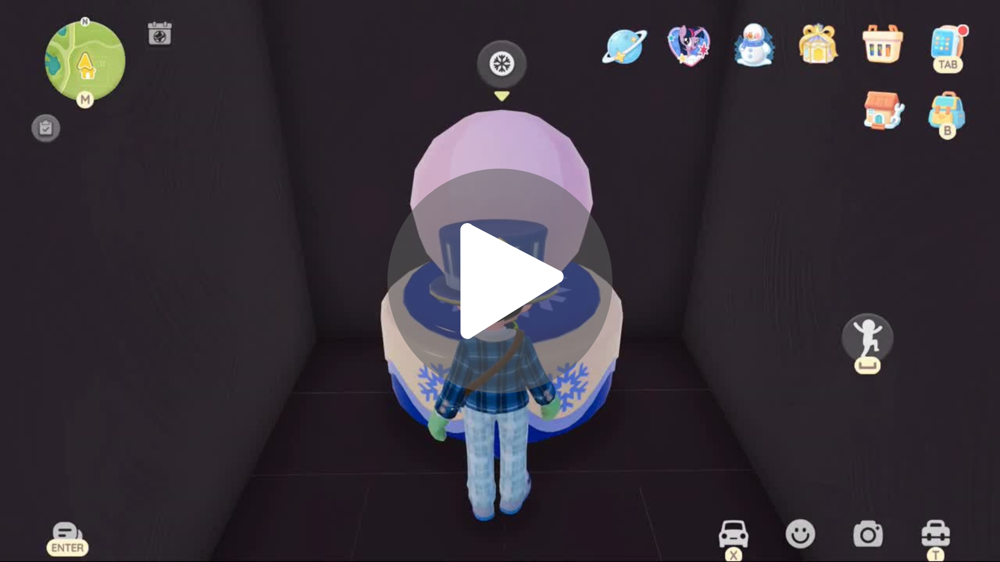
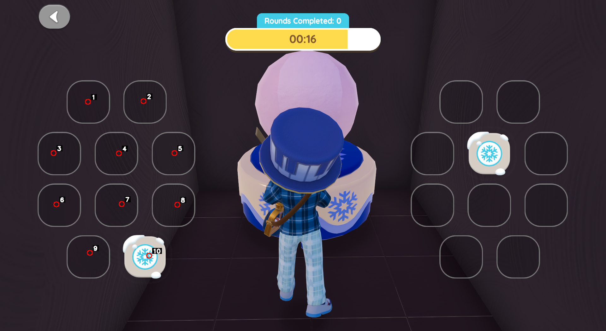
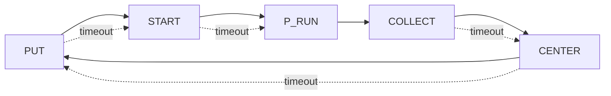

# Auto Snow Loop (Windows) — Template Click + ROI Routine

Two scripts, zero fluff:

1) **`capture_points.py`** — capture the center points of the LEFT-side slots and auto-generate RIGHT-side points (mirrored). Writes `points.json` + `points_preview.png`.
2) **`auto_snow_loop.py`** — main automation loop:
   - finds UI buttons via **template matching** (PNG icons in `images/`)
   - runs a **color ROI routine** over captured points during the **P_RUN** phase
   - clicks through a small state machine (“cascade”) repeatedly

> ⚠️ Disclaimer: Use responsibly. Provided as-is.  
> Windows is required due to DPI handling and `SendInput` (mouse injection).

---

## Demo (videos)

GitHub READMEs don’t reliably render MP4 inline like images, so the usual pattern is:
- show a **thumbnail image**
- clicking it opens the **.mp4**

### 1) Tutorial — how to capture points
[](media/save_points.mp4)  
Direct link: `media/save_points.mp4`

### 2) Running — automation loop in action
[](media/running.mp4)  
Direct link: `media/running.mp4`

### 3) Preview example (what the points overlay looks like)


> Tip: If you want different thumbnails for each video, add:
> - `media/save_points_thumb.png`
> - `media/running_thumb.png`
> …and replace the `preview_example.png` above.

---

## Repo layout

```
.
├─ auto_snow_loop.py
├─ capture_points.py
├─ config.json
├─ images/
│  ├─ put-snow.png
│  ├─ start-snow.png
│  └─ collect-sculture.png
└─ media/
   ├─ save_points.mp4
   ├─ running.mp4
   └─ preview_example.png
```

Generated at runtime (not required in git):
- `points.json`
- `points_preview.png`
- optionally `points-1920x1080.json` or `points-<WxH>.json`

---

## Requirements

- Windows 10/11
- Python 3.10+
- Packages:
  - `numpy`
  - `opencv-python`
  - `mss`

Install:

```bash
pip install numpy opencv-python mss
```

(or keep a `requirements.txt` if you prefer)

---

## Quickstart

### 1) Configure `config.json`

Minimum fields:
- `monitor.index` — MSS monitor index (usually `1` for primary)
- `files.points_file` — defaults to `points.json`
- `files.images_dir` — defaults to `images`

Example:

```json
{
  "monitor": {
    "index": 1,
    "width": 1920,
    "height": 1080
  },
  "debug": {
    "show_window": true,
    "window_monitor_index": 2,
    "show_scores": true
  },
  "detection": {
    "scan_interval": 0.05,
    "color_box": 70,
    "color_tol": 18,
    "color_min_count": 6,
    "color_min_sep": 6,
    "color_ratio_min": 0.2,
    "color_ratio_max": 5.0,
    "color_1": [255, 252, 255],
    "color_2": [74, 203, 242]
  },
  "click": {
    "delay": 0.03,
    "jitter": 0.0
  },
  "files": {
    "points_file": "points.json",
    "images_dir": "images"
  },
  "automation": {
    "start_key": "F7",
    "cancel_key": "F8",
    "state_pause_range": [1.0, 1.5],
    "p_interval_range": [0.9, 1.3],
    "p_duration_seconds": 19.5,
    "state_timeout_seconds": 5.0
  }
}
```

> **Important:** JSON does not allow trailing commas.

---

### 2) Capture points (your resolution)

Run:

```bash
python capture_points.py
```

Workflow:
- Press the **Start** hotkey.
- You have ~20 seconds to capture points (LEFT side only).
- The script mirrors them into RIGHT side points automatically.
- It writes:
  - `points.json`
  - `points_preview.png` (a frozen screenshot with numbered markers)

If you change monitor / resolution / Windows scaling, re-capture points.

---

### 3) Run automation

Run:

```bash
python auto_snow_loop.py
```

Controls:
- **F7** → start
- **F8** → stop/cancel (returns to idle)
- **q** → quit (only when `debug.show_window: true`)
- If window is disabled, quit with **Ctrl+C**

---

## Cascades (state machine)

The loop is a simple cascade of states:

1) **PUT** → click `put-snow.png`
2) **START** → click `start-snow.png`
3) **P_RUN** → run ROI routine for ~`p_duration_seconds`
4) **COLLECT** → click `collect-sculture.png`
5) **CENTER** → click the center of the monitor
6) repeat

Timeout behavior:
- If the script stays **> `state_timeout_seconds`** in any state except `P_RUN`, it **skips to the next state**.
- Cancel key stops immediately (even during `P_RUN`).



---

## Points fallback behavior (important)

`auto_snow_loop.py` tries points in this order:

1. `config.json -> files.points_file` (default: `points.json`)
2. `points-<WIDTH>x<HEIGHT>.json` (example: `points-2560x1440.json`)
3. **Only if current resolution is 1920x1080**: `points-1920x1080.json`

If none exists (or the file is invalid), it exits with a message telling you to record points and check this README.

---

## Monitor index (MSS)

MSS exposes monitors like:

- `monitors[0]` = full virtual desktop
- `monitors[1]` = primary monitor
- `monitors[2]` = secondary monitor
- ...

Print them:

```bash
python -c "from mss import mss; s=mss(); print(s.monitors)"
```

Then set `config.json -> monitor.index`.

---

## FAQ / Troubleshooting

### Why MP4 doesn’t show inline in README?
GitHub sanitizes/limits HTML in Markdown and MP4 embedding is inconsistent.
Use a clickable thumbnail instead:
```md
[](media/video.mp4)
```

### My clicks are slightly off (DPI / scaling)
- Set Windows Display Scale to **100%**
- Make sure the app is on the correct monitor (`monitor.index`)
- Re-capture points after any scaling/resolution change

### Template matching clicks the wrong place
Common causes:
- The icon is mostly flat/white (it matches huge bright regions)
- The template PNG has too much transparent padding

Fixes:
- Add a **dark background** behind the UI buttons (best fix)
- Crop templates tighter (remove empty margins)
- Raise thresholds (`thr_put`, `thr_start`, `thr_collect`) if you expose them in config

### `q` doesn’t quit
`q` is only handled when the debug window is open (`debug.show_window: true`).
Otherwise: use **Ctrl+C**.

---

## License

MIT
