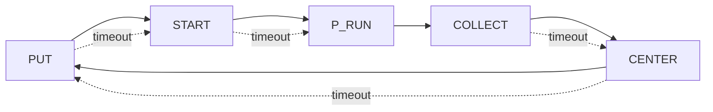

# Heartopia Winter Snow Sculpture — Auto Clicker (Windows)

Two scripts:

1) **`capture_points.py`** — capture slot center points on the **LEFT side**, mirror to generate the **RIGHT side**, and save:
   - `points.json`
   - `points_preview.png` (frozen screenshot + numbered markers)
2) **`auto_snow_loop.py`** — main loop:
   - detects UI buttons via **template matching** (`images/*.png`)
   - runs a **color ROI routine** over captured points during **P_RUN**
   - advances through a small state machine (“cascade”) and repeats

> ⚠️ Disclaimer: Use responsibly. Provided as-is.  
> Windows is required due to DPI handling and `SendInput` (mouse injection).

---

## Demos (YouTube)

GitHub doesn’t reliably preview `.mp4` in-repo. YouTube solves that cleanly.

### Capture points tutorial
[](https://www.youtube.com/watch?v=OLXRZFZll10)

### Running demo
[](https://www.youtube.com/watch?v=aTxlU8CyFwo)

### Points preview (example)


---

## Repo layout

```
.
├─ auto_snow_loop.py
├─ capture_points.py
├─ config.json
├─ images/
│  ├─ put-snow.png
│  ├─ start-snow.png
│  └─ collect-sculture.png
└─ media/
   └─ preview_example.png
```

Generated at runtime (optional to commit):
- `points.json`
- `points_preview.png`
- `points-1920x1080.json` or `points-<WxH>.json` (fallback presets)

---

## Requirements

- Windows 10/11
- Python 3.10+
- Packages:
  - `numpy`
  - `opencv-python`
  - `mss`

Install:

```bash
pip install -r requirements.txt
```

---

## Quickstart

### 1) Configure `config.json`

Minimum fields:
- `monitor.index` — MSS monitor index (usually `1` for primary)
- `files.points_file` — defaults to `points.json`
- `files.images_dir` — defaults to `images`

Example:

```json
{
  "monitor": { "index": 1, "width": 1920, "height": 1080 },
  "debug": { "show_window": true, "window_monitor_index": 2, "show_scores": true },
  "detection": {
    "scan_interval": 0.05,
    "color_box": 70,
    "color_tol": 18,
    "color_min_count": 6,
    "color_min_sep": 6,
    "color_ratio_min": 0.2,
    "color_ratio_max": 5.0,
    "color_1": [255, 252, 255],
    "color_2": [74, 203, 242]
  },
  "click": { "delay": 0.03, "jitter": 0.0 },
  "files": { "points_file": "points.json", "images_dir": "images" },
  "automation": {
    "start_key": "F7",
    "cancel_key": "F8",
    "state_pause_range": [1.0, 1.5],
    "p_interval_range": [0.9, 1.3],
    "p_duration_seconds": 19.5,
    "state_timeout_seconds": 5.0
  }
}
```

> **Important:** JSON does not allow trailing commas.

---

### 2) Capture points (your resolution)

Run:

```bash
python capture_points.py
```

Workflow:
- Press the **Start** hotkey.
- You have ~20 seconds to capture points (**LEFT side only**).
- The script mirrors them into RIGHT side points automatically.
- It writes:
  - `points.json`
  - `points_preview.png` (frozen screenshot with numbered markers)

If you change monitor / resolution / Windows scaling, re-capture points.

---

### 3) Run automation

Run:

```bash
python auto_snow_loop.py
```

Controls:
- **F7** → start
- **F8** → stop/cancel (returns to idle)
- **q** → quit (only when `debug.show_window: true`)
- If window is disabled, quit with **Ctrl+C**

---

## Cascades (state machine)

State flow:

1) **PUT** → click `put-snow.png`  
2) **START** → click `start-snow.png`  
3) **P_RUN** → run ROI routine for ~`p_duration_seconds`  
4) **COLLECT** → click `collect-sculture.png`  
5) **CENTER** → click the monitor center  
6) repeat

Timeout behavior:
- If the script stays **> `state_timeout_seconds`** in any state except `P_RUN`, it **skips to the next state**.
- Cancel stops immediately (even during `P_RUN`).



---

## Points fallback behavior (important)

If `files.points_file` is missing/invalid, `auto_snow_loop.py` tries:

1. `points-<WIDTH>x<HEIGHT>.json` (example: `points-2560x1440.json`)
2. **Only if current resolution is 1920x1080**: `points-1920x1080.json`

If nothing matches, it exits with an error telling you to record points (see “Capture points” above).

---

## FAQ / Troubleshooting
### My clicks are slightly off (DPI / scaling)
- Set Windows Display Scale to **100%**
- Ensure the app is on the configured monitor (`monitor.index`)
- Re-capture points after any scaling/resolution change

### Template matching clicks the wrong place
Common causes:
- icon is too flat/white and matches large bright regions
- template PNG has too much padding

Fixes:
- add a **dark background** behind UI buttons (best fix)
- crop templates tighter (remove empty margins)
- raise thresholds (`thr_put`, `thr_start`, `thr_collect`) if you expose them in config

### `q` doesn’t quit
`q` is only handled when the debug window is open (`debug.show_window: true`). Otherwise use **Ctrl+C**.

---

## License

MIT
